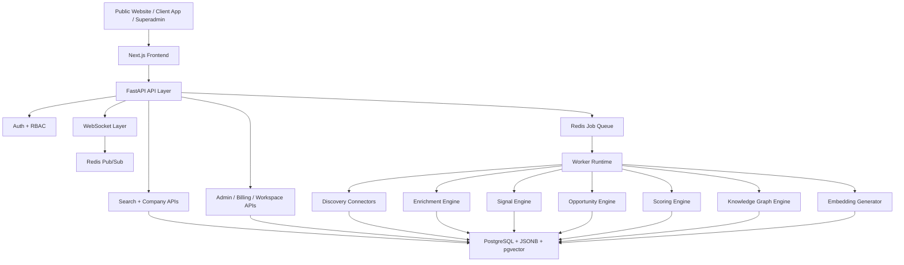

# AtlasBI Global Intelligence Platform

AtlasBI is a production-style AI Business Intelligence SaaS platform designed to discover companies, build intelligence profiles, detect commercial gaps, and convert those gaps into actionable lead opportunities.

This repository contains the full monorepo for:

- a public multi-page website
- a client-facing SaaS workspace
- a superadmin operations console
- a FastAPI backend
- a distributed worker/crawler runtime
- a PostgreSQL + pgvector data model
- Redis-backed job orchestration

The platform is currently optimized around an India-first discovery workflow and lead-intelligence engine, then structured to expand globally.

## What The Platform Does

AtlasBI is built to answer a simple commercial question at scale:

`Which businesses exist, what is their current digital maturity, and what services or software are they most likely to need next?`

The system discovers businesses, enriches them, scores them, and turns those findings into commercial opportunity signals such as:

- business has a phone number but no website
- business has a website but weak reviews
- business appears only in directories and has poor owned-media presence
- business lacks visible CRM, automation, or booking software
- business shows growth or hiring behavior that indicates budget and intent

That allows the product to function as:

- an intelligence database
- an AI search engine
- a lead discovery engine
- a commercial opportunity detection engine
- a superadmin-operated crawler platform

## Product Surfaces

The product is split into three distinct experiences.

### 1. Public Website

The public website is the entry point for the product and includes:

- home page
- product page
- pricing page
- about page
- contact page
- header and footer navigation
- login CTA

Flow:

`Website -> Login -> Role-based app routing`

### 2. Client SaaS Workspace

The client application is for paying customer users.

It includes:

- dashboard
- AI search
- company explorer
- saved leads
- exports
- alerts
- insights
- workspace management
- billing

Client users do not manage crawlers directly. They consume the indexed intelligence and lead opportunities.

### 3. Superadmin Operations Console

The superadmin surface is for internal platform operators.

It includes:

- crawler operations
- connector monitoring
- job queue monitoring
- client organization management
- user account management
- memberships
- subscriptions
- invoices
- payment methods
- support tickets and notes
- platform config
- logs
- finance and analytics

This is the internal control plane for the company running AtlasBI.

## Monorepo Layout

```text
.
├─ apps/
│  ├─ web/                  Next.js 14 App Router frontend
│  ├─ api/                  FastAPI backend
│  └─ worker/               Async crawler and enrichment workers
├─ docs/                    Architecture, deployment, audit notes
├─ infra/                   Cron examples and infrastructure helpers
├─ scripts/                 Local run, seed, and validation scripts
├─ supabase/
│  └─ migrations/           PostgreSQL schema and enterprise migrations
├─ tests/                   Python integration and engine tests
├─ docker-compose.yml       Local infrastructure orchestration
└─ .env.example             Environment template
```

## Tech Stack

### Frontend

- Next.js 14 App Router
- TypeScript
- TailwindCSS
- ShadCN-style component patterns
- Framer Motion
- Three.js

### Backend

- FastAPI
- async Python services
- JWT authentication
- RBAC
- WebSockets

### Data

- PostgreSQL
- JSONB
- pgvector
- Redis / Upstash-compatible queueing

### Crawling / Processing

- Python async workers
- Playwright
- HTTP fallback discovery flows
- retry / rate-limit aware job execution

## Architecture At A Glance



## End-To-End Lifecycle

### Step 1. Discovery

Discovery starts with a query, a geography, or a seed job.

Examples:

- `restaurants needing website`
- `Mumbai hospitality businesses`
- `geo grid around Bengaluru`
- `India seed crawl`

Discovery jobs are created by:

- superadmin UI
- background jobs
- seed scripts
- future scheduled presets

Discovery sources are modeled through a source registry and connector layer. The current platform supports source-aware handling for:

- `india_local`
- `google_business_profiles`
- `google_maps`
- `justdial`
- `sulekha`
- `tracxn`
- `indiamart`
- hybrid / fallback discovery modes

### Step 2. Crawl Planning

Each job is normalized into crawl parameters such as:

- query
- city
- region
- country
- source
- keyword set
- industries
- employee range
- rating thresholds
- review thresholds
- website presence filter
- radius or grid

The planner fans jobs out into worker-executable tasks.

### Step 3. Listing Extraction

The worker resolves listing pages and normalizes them into structured business records.

This stage includes:

- source filtering
- domain validation
- crawl telemetry
- listing candidate extraction
- detail candidate extraction
- pagination candidate extraction

### Step 4. Detail Hydration

The connector runtime follows accepted detail URLs and merges richer business data back into the record.

Merged detail fields include:

- name
- address
- phone
- website
- rating
- reviews count
- categories
- description
- industry
- subindustry

### Step 5. Website Enrichment

If a company website exists, the enrichment engine extends the profile with:

- emails
- phone numbers
- technology hints
- social links
- CRM hints
- automation hints
- channel presence
- digital completeness

### Step 6. Signal Generation

The signal engine computes business intelligence events such as:

- `no_website`
- `low_rating`
- `high_reviews`
- `directory_only_presence`
- `weak_review_presence`
- `limited_social_presence`
- `weak_digital_presence`
- `hiring_activity`
- `rapid_growth`

### Step 7. Opportunity Generation

The opportunity engine transforms signals and enrichment gaps into lead opportunities.

Examples:

- website development
- marketing agency opportunity
- local SEO opportunity
- reputation management
- social presence buildout
- CRM modernization
- workflow automation
- booking or lead-capture system build
- software transformation opportunity

### Step 8. Scoring

Each company is scored across:

- `health_score`
- `growth_score`
- `opportunity_score`

These scores combine:

- digital presence
- completeness
- intent indicators
- adoption signals
- reviews
- owned-vs-directory presence

### Step 9. Searchability

The final company profile is stored for:

- filter-based retrieval
- keyword retrieval
- vector retrieval
- hybrid ranking
- company detail pages
- admin analytics

### Step 10. Client Consumption

Client users consume that intelligence through:

- AI search
- lead cards
- saved leads
- insights
- exports
- alerts

## Lead Intelligence Logic

The core business value of AtlasBI is not just crawling business listings. It is interpreting those listings as commercial need states.

### Example: Phone Number Exists, Website Missing

Interpretation:

- business is reachable
- business is listed publicly
- business has not invested in owned digital presence

Potential opportunities:

- website development
- branding
- lead funnel design
- local marketing
- agency services

### Example: Website Exists, Reviews Weak, Presence Low

Interpretation:

- business has some maturity
- discoverability and reputation are underdeveloped

Potential opportunities:

- SEO
- reputation management
- local search optimization
- review generation workflows
- social media management

### Example: Website Exists, No CRM Or Automation Signals

Interpretation:

- business may already spend on growth
- internal operations may still be manual

Potential opportunities:

- CRM
- lead routing
- automation
- sales ops software
- workflow tools

### Example: Directory-Only Presence

Interpretation:

- business depends on third-party discovery rather than owned channels

Potential opportunities:

- owned website
- owned lead capture
- SEO foundation
- brand positioning
- software stack modernization

This logic is intentionally extensible. The platform is structured so new rule packs can be added per:

- industry
- city type
- company size
- digital maturity
- source family
- intent profile

## Crawler System Design

### Worker Responsibilities

The worker runtime is responsible for:

- consuming Redis jobs
- executing discovery tasks
- parsing listing and detail pages
- enriching records
- generating signals and opportunities
- computing scores
- updating the graph
- producing embeddings
- writing logs and telemetry

### Core Worker Characteristics

- async execution
- retry logic
- rate limiting
- source-specific routing
- bounded pagination
- bounded detail traversal
- source diagnostics
- queue-driven fanout

### Connector Concepts

The connector layer separates:

- source registry
- parser registry
- directory runtime
- source policies
- crawl telemetry
- merge logic

This prevents source logic from leaking into the rest of the application.

### Current Connector Capabilities

- source registry
- source domain filtering
- parser registry
- listing extraction
- detail candidate extraction
- detail hydration
- pagination candidate extraction
- bounded listing traversal
- bounded detail traversal
- connector diagnostics
- worker integration

## Search System

The search layer supports both structured and natural-language retrieval.

### Search Inputs

- free text query
- country
- industry
- minimum opportunity score
- minimum growth score
- sort mode

### Search Outputs

- total matches
- ranked company results
- suggested filters
- applied filters
- lead rationale
- source coverage

### Example Queries

- `fast growing startups`
- `companies needing CRM`
- `restaurants with bad reviews`
- `restaurants needing website`
- `manufacturers hiring operations managers`

### Vector / Embedding Layer

The repository includes:

- embedding generation hooks
- hosted embedding path support
- hosted rerank path support
- local fallback logic
- pgvector storage design

## Database Design

The schema is normalized around platform entities and uses JSONB for flexible enrichment.

### Core Tables

- `companies`
- `signals`
- `opportunities`
- `relationships`
- `crawl_jobs`
- `users`
- `exports`
- `logs`

### Enterprise / SaaS Tables

- `organizations`
- `memberships`
- `subscriptions`
- `usage_events`
- `api_keys`
- `audit_events`
- `payment_methods`
- `invoices`
- `support_tickets`
- `support_notes`
- `crawler_presets`

### Why JSONB Is Used

JSONB is used for:

- enrichment payloads
- source metadata
- flexible technology data
- provider responses
- crawl diagnostics
- organization settings

### Why pgvector Is Used

pgvector is used for:

- semantic retrieval
- hybrid search ranking
- future similarity search
- opportunity clustering

## API Surface

The API exposes the operational and product surface.

### Product APIs

- `/api/v1/search`
- `/api/v1/company`
- `/api/v1/signals`
- `/api/v1/opportunities`
- `/api/v1/insights`
- `/api/v1/dashboard`
- `/api/v1/alerts`
- `/api/v1/exports`
- `/api/v1/saved-leads`

### Identity APIs

- `/api/v1/auth/login`
- `/api/v1/auth/register`
- `/api/v1/auth/me`

### Workspace / Billing APIs

- `/api/v1/workspace`
- `/api/v1/workspace/organizations`
- `/api/v1/workspace/api-keys`
- `/api/v1/billing/*`
- `/api/v1/machine/*`

### Superadmin APIs

- `/api/v1/admin/overview`
- `/api/v1/admin/jobs`
- `/api/v1/admin/logs`
- `/api/v1/admin/configs`
- `/api/v1/admin/connectors`
- `/api/v1/admin/organizations`
- `/api/v1/admin/users`
- `/api/v1/admin/memberships`
- `/api/v1/admin/invoices`
- `/api/v1/admin/payment-methods`
- `/api/v1/admin/support`
- `/api/v1/admin/crawler-presets`

### Health / Observability APIs

- `/health`
- `/ready`
- `/metrics`

## Frontend Structure

### Public Website Pages

- `/`
- `/product`
- `/pricing`
- `/about`
- `/contact`

### Auth Pages

- `/login`

### Client Workspace Routes

- `/dashboard`
- `/search`
- `/company/[slug]`
- `/leads`
- `/exports`
- `/alerts`
- `/insights`
- `/workspace`
- `/billing`

### Superadmin Routes

- `/superadmin`
- `/superadmin/clients`
- `/superadmin/clients/[id]`
- `/superadmin/accounts`
- `/superadmin/crawlers`
- `/superadmin/configs`
- `/superadmin/logs`
- `/superadmin/subscriptions`
- `/superadmin/payment-methods`
- `/superadmin/invoices`
- `/superadmin/support`
- `/superadmin/finance`

## Security Model

### Authentication

- JWT-based auth
- cookie-backed session flow for the web app
- bootstrap admin support

### Authorization

- RBAC
- superadmin-specific controls
- package-aware feature gating for client users

### Platform Safeguards

- rate limiting
- API key scopes
- audit events
- usage tracking

## Pricing / Feature Gating

Client features are gated by plan tier.

Current plan model:

- `starter`
- `growth`
- `enterprise`

The app shell and access layer evaluate:

- feature visibility
- route access
- upgrade prompts
- plan labels

## Billing And Workspace Model

The enterprise SaaS layer supports:

- organizations
- memberships
- subscriptions
- seats
- payment methods
- invoices
- seat invites
- API keys
- audit events
- usage events

This lets one internal platform manage multiple client workspaces with package-aware access.

## Realtime System

Realtime capabilities are supported via:

- WebSocket endpoint
- Redis pub/sub support
- live event broadcasting

Events can represent:

- new crawl output
- new signals
- new opportunities
- system notifications

## Observability And Operations

### Health Endpoints

- `/health` for process liveness
- `/ready` for dependency readiness
- `/metrics` for Prometheus-style scraping

### Admin Telemetry Includes

- queue depth
- active jobs
- dataset size
- connector drilldowns
- recent logs
- source health
- client and account counts

## Local Development Runbook

### 1. Environment Setup

Copy:

```powershell
Copy-Item .env.example .env
```

Review:

- database URLs
- Redis URL
- JWT secret
- optional vendor credentials
- frontend API URLs

### 2. Infrastructure

Bring up local dependencies with Docker if desired:

- PostgreSQL
- Redis

Or point the app at:

- Supabase PostgreSQL
- managed Redis / Upstash

### 3. Install Dependencies

Frontend:

```powershell
npm install
```

API:

```powershell
python -m pip install -r apps/api/requirements.txt
```

Worker:

```powershell
python -m pip install -r apps/worker/requirements.txt
```

Playwright browser:

```powershell
python -m playwright install chromium
```

### 4. Apply Database Migrations

Run the SQL in:

- `supabase/migrations/001_init.sql`
- `supabase/migrations/002_enterprise.sql`

### 5. Start Services

API:

```powershell
./scripts/run-api.ps1
```

Worker:

```powershell
./scripts/run-worker.ps1
```

Frontend:

```powershell
npm run dev:web
```

### 6. Seed Demo Data

```powershell
./scripts/seed-demo.ps1
```

### 7. Login

Superadmin:

- `admin@atlasbi.local`
- `AtlasBI-Admin-2026`

Client:

- `client@atlasbi.local`
- `AtlasBI-Client-2026`

## Current Live Local Defaults

Depending on the launch script and validation cycle, the app commonly runs on:

- frontend: `http://127.0.0.1:3003`
- API: `http://127.0.0.1:8011`

Other ports may be used during repeated local restart/debug cycles.

## Verification Commands

Frontend build:

```powershell
npm run build:web
```

Python tests:

```powershell
npm run test:python
```

Python compile smoke:

```powershell
python -m compileall apps/api/app apps/worker/worker tests
```

Playwright UI validation:

```powershell
python scripts/ui_validate.py
```

## Deployment Targets

### Frontend

- Vercel

### API / Worker

- Railway
- self-hosted Docker
- VM / container platform

### Database

- Supabase PostgreSQL with pgvector

### Queue

- Upstash Redis
- self-hosted Redis

## Environment Variables

See `.env.example` for the full template.

Important groups include:

### Core

- `JWT_SECRET`
- `DATABASE_URL`
- `SYNC_DATABASE_URL`
- `REDIS_URL`

### Frontend Runtime

- `NEXT_PUBLIC_API_URL`
- `NEXT_PUBLIC_WS_URL`
- `API_URL`
- `WS_URL`

### Crawling

- `CRAWLER_CONCURRENCY`
- `CRAWLER_MAX_RETRIES`
- `CRAWLER_DEFAULT_REGION`
- `PROXY_POOL`
- `ENABLE_PROXY_ROTATION`
- `ENABLE_RATE_LIMITING`

### AI / Providers

- `OPENAI_API_KEY`
- provider-specific discovery and enrichment keys as needed

## Important Scripts

- `scripts/run-api.ps1`
- `scripts/run-worker.ps1`
- `scripts/seed-demo.ps1`
- `scripts/ui_validate.py`

## Documentation

Additional docs live in:

- `docs/architecture.md`
- `docs/deployment.md`
- `docs/completion-audit.md`
- `docs/integrations.md`

## Current Status

What is already in place:

- public website
- client workspace
- superadmin console
- auth and RBAC
- queue-based crawl orchestration
- India seed expansion
- connector registry
- parser registry
- discovery and enrichment engines
- signals and opportunity engines
- scoring
- knowledge graph relationships
- hybrid search path
- billing and workspace entities
- admin client/account management
- logs, configs, invoices, support, payment methods
- UI validation tooling

What still depends on external production credentials rather than missing application code:

- OpenAI hosted embeddings / rerank
- live SerpAPI / provider-backed discovery
- live Hunter / PDL enrichment
- live Stripe billing flows
- cloud deployment secrets and vendor accounts

## Recommended Next Expansion Areas

If continuing platform development, the most impactful next steps are:

1. strengthen live source-specific selector sets for each approved connector
2. add recurring crawler schedules and scheduler UI
3. complete source governance and connector policy controls
4. expand industry-specific opportunity rule packs
5. add SSO / SCIM and deeper enterprise compliance tooling
6. wire full cloud deployment automation and secret management

## Summary

AtlasBI is not just a crawler. It is a layered intelligence system:

- discovery finds businesses
- enrichment turns records into profiles
- signals detect gaps
- opportunities convert gaps into lead hypotheses
- search makes the data commercially usable
- superadmin controls the ingestion engine
- clients consume the resulting intelligence as a SaaS product

That separation is the core architecture of the platform.
